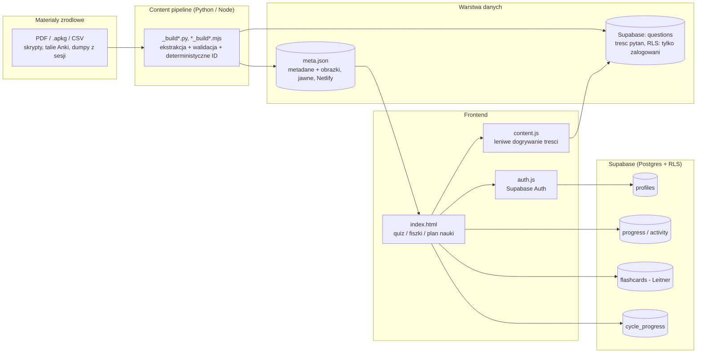

# Kocia Baza Wiedzy

Aplikacja webowa do nauki i powtórek do egzaminów na studiach medycznych — bank pytań (tryb testowy i tryb wpisywania odpowiedzi), fiszki z systemem powtórek Leitnera, tryb "trudne pytania", interaktywny atlas anatomiczny 3D oraz profil użytkownika z synchronizacją postępów między urządzeniami.

To repozytorium zawiera **kod aplikacji i pipeline'y generujące treść**. Same treści (baza pytań, obrazy, materiały źródłowe) nie są tu publikowane — patrz sekcja [Co celowo nie jest w repo](#co-celowo-nie-jest-w-repo).

## Funkcje

- **Bank pytań** — tryb testowy (ABCDE) i tryb wpisywania odpowiedzi, z wytłumaczeniem teoretycznym (`rationale`) przy każdym pytaniu.
- **Fiszki (Leitner)** — kolejka powtórek oparta o system pudełek Leitnera, z osobną kolejką błędnych odpowiedzi.
- **Cykl nauki** — tygodniowy plan powtórek zsynchronizowany między urządzeniami (`cycle_progress` w Supabase).
- **Profil użytkownika** — awatary, statystyki, agregacja wyników per rok studiów.
- **Dashboard statystyk** (`dashboard.html`) — wykresy skuteczności w czasie i najsłabszych kategorii, liczone client-side z danych `progress`/`activity`.
- **Tryb offline (PWA)** — service worker cache'ujący powłokę aplikacji, instalowalna jako aplikacja (manifest).
- **Atlas anatomiczny 3D** (`atlas.html` → `_atlas_v2/build_full/atlas_pilot_v3.html`) — Three.js, pełny model Z-Anatomy (CC BY-SA, ~2800 struktur w 9 warstwach: szkielet, mięśnie, naczynia, nerwy, mózg, narządy, zęby, tkanka łączna, układ chłonny), ładowany po jednym Draco-GLB na warstwę z Cloudflare R2. Punkty orientacyjne na powierzchni struktury, szpilki kolokwiów, przekrój, skalpel, tryb quizu, ruchome panele. Osobna przeglądarka narządów (`_organ_compare/`) porównuje 3 źródła (Z-Anatomy / CT pacjenta / NIH). Pipeline ekstrakcji z `.blend` (headless Blender) i pakowania w `_atlas_v2/`. Poprzednia wersja na siatkach BodyParts3D: `atlas_pilot.html` (zostaje lokalnie, niewdrażana).
- **Autoryzacja** — logowanie, potwierdzenie e-mail, reset hasła (Supabase Auth + RLS).
- **Edge Function** (`supabase/functions/today-plan`, Deno/TypeScript) — agreguje najbliższe kolokwia ze wszystkich przedmiotów usera jednym zapytaniem po stronie serwera, zasila widget w profilu.

## Stos technologiczny

- **Frontend**: vanilla JS + HTML/CSS (bez frameworka), Three.js (moduł atlasu 3D)
- **Backend/dane**: Supabase (Postgres + Auth + Row Level Security)
- **Content pipeline**: Node.js (`.mjs`) i Python — parsowanie PDF-ów, plików Anki (`.apkg`), dumpów CSV/DOCX z sesji egzaminacyjnych do jednolitego formatu pytań

## Architektura

Pełny opis decyzji projektowych w [ARCHITECTURE.md](ARCHITECTURE.md). Skrót w diagramie:



## Struktura repozytorium

```
index.html                 punkt wejścia aplikacji (quiz/fiszki/profil)
dashboard.html              statystyki nauki (wykresy)
stats.js                    czyste funkcje liczące statystyki (testowalne bez przeglądarki)
atlas_pilot.html           atlas anatomiczny 3D
auth.js, storage.js,       logika frontendowa (autoryzacja, zapisywanie
study_plan.js, ...         stanu, plan nauki, walidacja)
content.js                 leniwe ładowanie treści pytań z Supabase (RLS)
supabase-client.js,        konfiguracja klienta Supabase (klucz "anon" —
supabase-config.js         bezpieczny publicznie, ochronę daje RLS w bazie)
supabase_schema_*.sql      schematy bazy danych (tabele, RLS, triggery)
manifest.json, sw.js        PWA: instalowalność + tryb offline (cache app shell)
tests/                       testy jednostkowe (Vitest) dla id-utils/validator/stats
_build_*.py, _landmark_*.mjs   pipeline generowania/etykietowania danych
                                atlasu 3D (kości, punkty anatomiczne)
*_build*.py, *_build*.mjs      pipeline konwersji materiałów źródłowych
                                (PDF/Anki/CSV) na strukturę pytań
```

## Testy

```bash
npm install
npm test
```

Testy jednostkowe (Vitest) pokrywają czyste funkcje bez zależności od przeglądarki/Supabase: deterministyczne ID pytań (`id-utils.js`), walidację bazy pytań (`validator.js`) i liczenie statystyk do dashboardu (`stats.js`).

## Co celowo nie jest w repo

Pełny szczegół w `.gitignore`, w skrócie:

- **Materiały źródłowe** (PDF-y podręczników, talie Anki, nagrania audio) — prawa autorskie należą do wydawców/autorów.
- **Wygenerowana baza pytań** (`meta.json`, `questions.json` i pochodne) — linkuje m.in. zeskanowane ryciny z atlasów anatomicznych (hostowane osobno), które nie są moim utworem i nie mogę ich publikować. Sama baza pytań jest też częścią działającej aplikacji dla studentów, nie materiałem promocyjnym.
- **Duplikaty wdrożeniowe** (`netlify_deploy/`) — zwierciadło plików z roota używane tylko do deployu.

## Uwaga o procesie pracy

Duża część kodu (w tym pipeline'y konwersji treści i moduł atlasu 3D) powstała w iteracyjnej współpracy z Claude Code — z ręcznym doborem modelu (Opus do treści merytorycznych, Sonnet do kodu) i code review każdej zmiany przed wdrożeniem.
